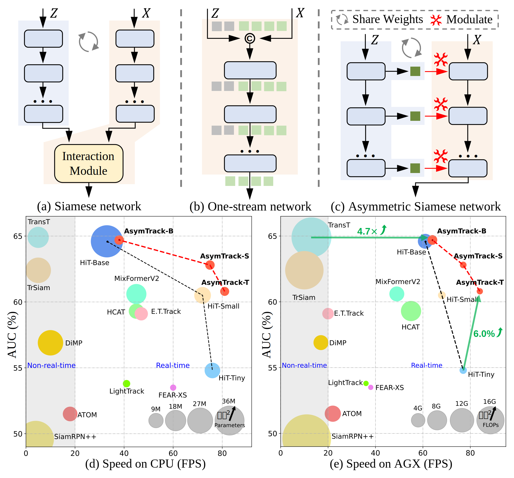
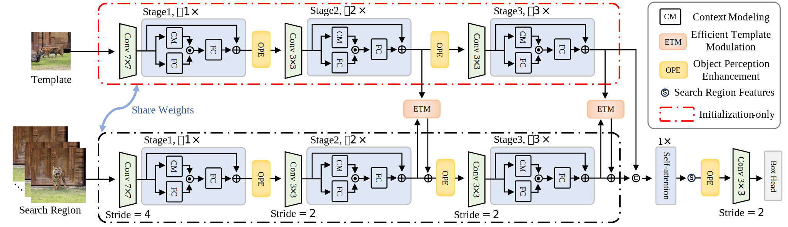
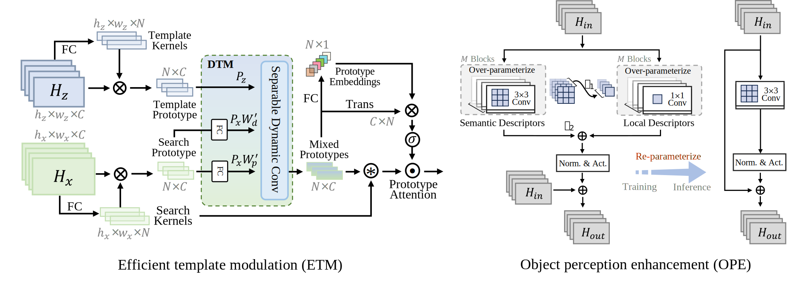
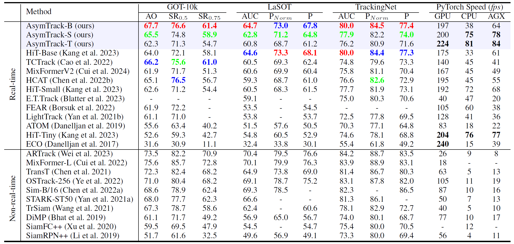

# Two-stream Beats One-stream: Asymmetric Siamese Network for Efficient Visual Tracking [AAAI25]
Official implementation of [**AsymTrack**](https://arxiv.org/abs/xxx), including models and training&testing codes.

[Models & Raw Results](https://drive.google.com/drive/folders/18253JykIqLkugA4PhD9oJwt1wlr0rIt7?usp=drive_link)
(Google Driver)
[Models & Raw Results](https://pan.baidu.com/s/13sQC4U8Morlxq41Drbv7zA?pwd=asym)
(Baidu Driver: asym)

<center></center>

:fire: This work proposes AsymTrack, a new asymmetric siamese framework for efficient visual tracking.

## News
**[Mar 1, 2025]**
- We release codes, models and raw results. \
Thanks for your star.

**[Dec 10, 2024]**

- AsymTrack is accepted to AAAI2025.

<center></center>

## Introduction
- :fire: A new asymmetric siamese framework for efficient visual tracking, beats the current prevailing one-stream pipeline.

- An efficient template modulation (ETM) mechanism for relation modeling, paired with an object perception enhancement (OPE) module.

- AsymTrack series, tailored for resource-constrained platforms (GPU & CPU & edge AI devices), leads in both accuracy and speed.

- We envision the AsymTrack family becoming a dependable visual tracking solution for real-world deployment, bridging the gap between academic research and industrial applications.
- 
<center></center>

## Performance
AsymTrack outperforms state-of-the-art efficient trackers and achieves superior running speed across diverse computing platforms.
This approach broadens the possibilities for real-time visual tracking on resource-constrained platforms, offering a viable alternative to one-stream architectures.

<center></center>

## Usage
### Installation
Create and activate a conda environment:
```
conda create -n asymtrack python=3.9
conda activate asymtrack
```
Install the required packages:
```
bash install_asymtrack.sh
```

### Data Preparation
Put the training datasets in ./data/. It should look like:
   ```
${AsymTrack_ROOT}
 -- data
     -- lasot
         |-- airplane
         |-- basketball
         |-- bear
         ...
     -- got10k
         |-- test
         |-- train
         |-- val
     -- coco
         |-- annotations
         |-- images
     -- trackingnet
         |-- TRAIN_0
         |-- TRAIN_1
         ...
         |-- TRAIN_11
         |-- TEST
   ```

### Path Setting
Run the following command to set paths:
```
cd <PATH_of_ViPT>
python tracking/create_default_local_file.py --workspace_dir . --data_dir ./data --save_dir ./output
```
You can also modify paths by these two files:
```
./lib/train/admin/local.py  # paths for training
./lib/test/evaluation/local.py  # paths for testing
```

### Training
Dowmload the pretrained [backbone model](https://drive.google.com/drive/folders/1WEYAdTTfchflLlTQtV_po_6CJYIVN2A3?usp=sharing) and put it under ./pretrained_model/.

   ```
   python -m torch.distributed.launch --nproc_per_node 2 lib/train/run_training.py --script AsymTrack --config base --save_dir .
   ```

   (Optionally) Debugging training with a single GPU
   ```
   python lib/train/run_training.py --script AsymTrack --config base --save_dir .
   ```

### Testing and evaluation on benchmarks
#### GOT10K
   ```
   python tracking/test.py AsymTrack base --dataset got10k_test --threads 2 --num_gpus 2
   python lib/test/utils/transform_got10k.py --tracker_name AsymTrack --cfg_name base
   ```
#### LaSOT
   ```
   python tracking/test.py AsymTrack base --dataset lasot --threads 2 --num_gpus 2
   python tracking/analysis_results.py --dataset_name lasot --tracker_name AsymTrack --tracker_version base
   ```
#### TrackingNet
   ```
   python tracking/test.py AsymTrack base --dataset trackingnet --threads 2 --num_gpus 2
   python lib/test/utils/transform_trackingnet.py --tracker_name AsymTrack --cfg_name base 
   ```

### Speed Testing 
   ```
   python tracking/profile_model_asymtrack.py --script AsymTrack --config tiny
   ```

## Acknowledgment
- This repo is based on [HiT](https://github.com/kangben258/HiT) which is an excellent work.
- We thank for the [PyTracking](https://github.com/visionml/pytracking) library, which helps us to quickly implement our ideas.

